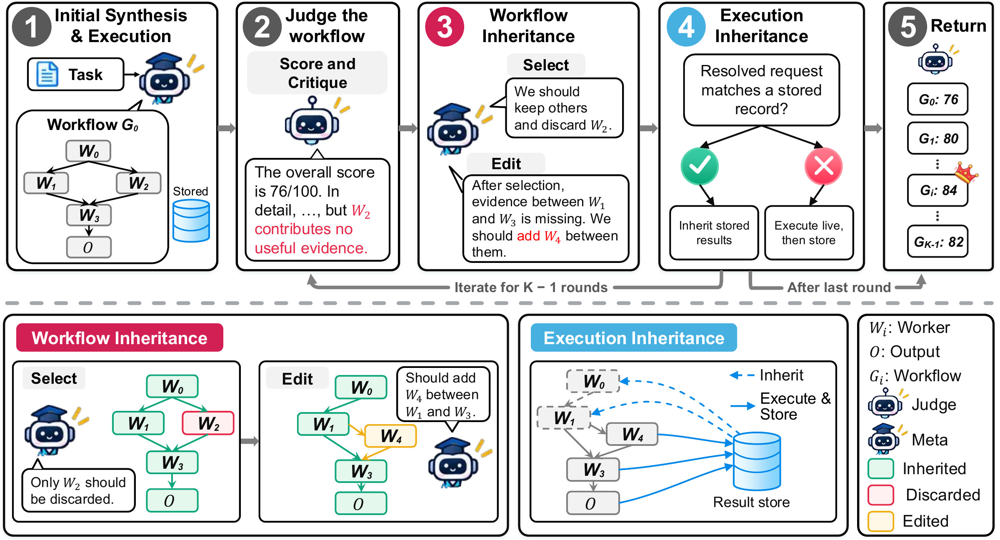

# Inherit-MAS

[](https://arxiv.org/abs/2610.02396)
[](https://huggingface.co/papers/2610.02396)

Run Inherit-MAS and its baselines on WorkBench and HotpotQA FullWiki.

## Method



Workflow inheritance retains useful nodes of the latest completed candidate and applies one validated edit to the kept workflow. Execution inheritance reuses eligible stored results only when the complete resolved request and execution context match; all other nodes execute live. The figure shows the ordinary refinement path, omitting invalid attempts and synthesis fallbacks.

## WorkBench Results

Table 1 from the paper reports completion percentages by worker backbone and domain. Bold marks the best MAS result within each backbone, excluding the Single ReAct reference. Overall is the primary metric, computed across all 130 evaluation tasks rather than as an unweighted mean of domain scores.

### GPT-4o-mini Workers

| System | Analytics | Calendar | CRM | Email | Project mgmt. | Multi-domain | Overall |
| :--- | ---: | ---: | ---: | ---: | ---: | ---: | ---: |
| Single ReAct (reference) | 35.0 | 50.0 | 20.0 | 35.0 | 20.0 | 60.0 | 41.5 |
| EvoAgent | 55.0 | 40.0 | **20.0** | 25.0 | 20.0 | 35.0 | 33.8 |
| EvoMAS | 25.0 | 35.0 | **20.0** | 35.0 | 20.0 | 37.5 | 30.8 |
| TacoMAS | 20.0 | 55.0 | **20.0** | 5.0 | 20.0 | 57.5 | 34.6 |
| **Inherit-MAS** | **60.0** | **75.0** | **20.0** | **45.0** | **35.0** | **67.5** | **55.4** |

### Qwen3-32B Workers

| System | Analytics | Calendar | CRM | Email | Project mgmt. | Multi-domain | Overall |
| :--- | ---: | ---: | ---: | ---: | ---: | ---: | ---: |
| Single ReAct (reference) | 65.0 | 55.0 | 20.0 | 35.0 | 25.0 | 55.0 | 46.2 |
| EvoAgent | 25.0 | 30.0 | 20.0 | 20.0 | 20.0 | 40.0 | 28.5 |
| EvoMAS | 20.0 | 35.0 | 20.0 | 30.0 | 15.0 | **52.5** | 33.1 |
| TacoMAS | 35.0 | **60.0** | **40.0** | 0.0 | **25.0** | 42.5 | 34.6 |
| **Inherit-MAS** | **75.0** | 50.0 | 20.0 | **40.0** | 20.0 | **52.5** | **46.2** |

## Install

Requires Python 3.10. HotpotQA also requires Java 21.

```bash
git clone https://github.com/CrazyMint/Inherit-MAS.git
cd Inherit-MAS
conda env create -f environment.yml
conda activate inherit-mas
```

Alternatively, install Java 21 separately and use `pip install -r requirements.txt` in a Python 3.10 environment.

## Configure

```bash
cp .env.example .env
cp credentials.example.json credentials.json
```

Set `OPENAI_BASE_URL` and `OPENAI_API_KEY` in `.env` for your OpenAI-compatible Chat Completions API. Set the API model names in `credentials.json`. Do not commit either file. Defaults are GPT-4o-mini for workers and GPT-5.4-mini for controller/judge calls. EvoAgent uses the worker model for every role.

WorkBench data is included. For HotpotQA:

```bash
python scripts/download_hotpotqa.py
```

The CPU-based BM25 index downloads on first use. Retrieval dependencies and the index need substantial disk space. Set `HF_HOME` and `PYSERINI_CACHE` to choose download locations.

## Run

```bash
python run.py run workbench --limit 3 --task-concurrency 1 --usd-cap 2 --out runs/workbench
python run.py run hotpotqa --limit 3 --task-concurrency 1 --usd-cap 2 --out runs/hotpotqa
```

`--task-concurrency` sets the maximum number of benchmark tasks executed concurrently, not the number of LLM agents within a task.

Use `--method` to select `inherit-mas` (default), `single-react`, `evoagent`, `evomas`, or `tacomas`. Use `--backbone gpt-4o-mini` (default) or `--backbone qwen3-32b`.

See [additional setup](docs/SETUP.md) for EvoMAS, TacoMAS, and local Qwen3-32B.

Commands may make paid API calls. `--usd-cap` is an estimate, not a billing guarantee or GPU limit; in-flight work may exceed it. Remove `--limit` for the full task manifest. Repeating a command resumes checkpoints. Inherit-MAS retries infrastructure failures, retains completed tasks, and keeps earlier attempt costs. Use a new output directory when changing the configuration, model deployment, or endpoint. Run generated-code baselines in an isolated container or VM.

## Score

```bash
python run.py score --out runs/workbench
python run.py score --out runs/hotpotqa
```

Scoring makes no model calls, rejects incomplete runs, and writes `SCORE.json`. Check progress in `RUN_STATUS.json`.

## Test

```bash
python scripts/smoke_test.py
python -m pytest -q
```

Tests use fake clients without API spend. Add `--dry-run` to a run command to validate task selection without model calls.

See [LICENSE](LICENSE) and [THIRD_PARTY.md](THIRD_PARTY.md) for licensing.
